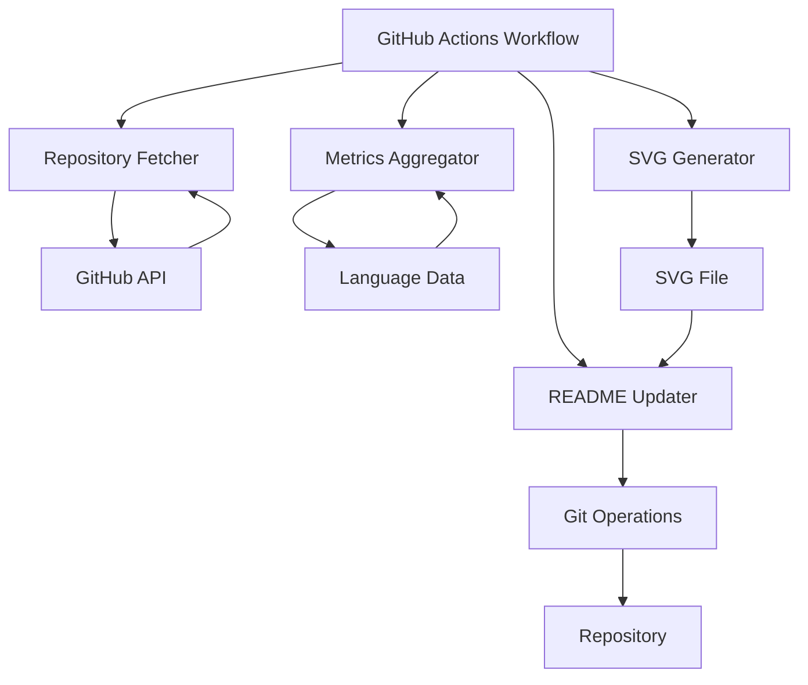
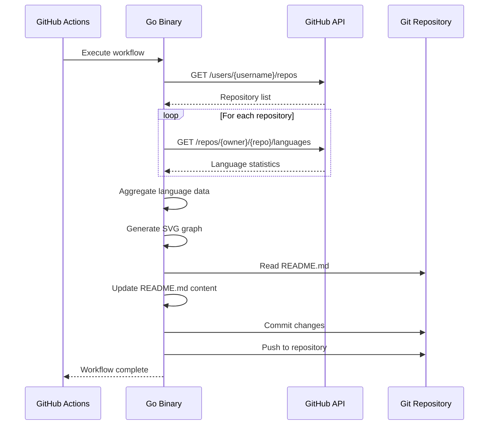
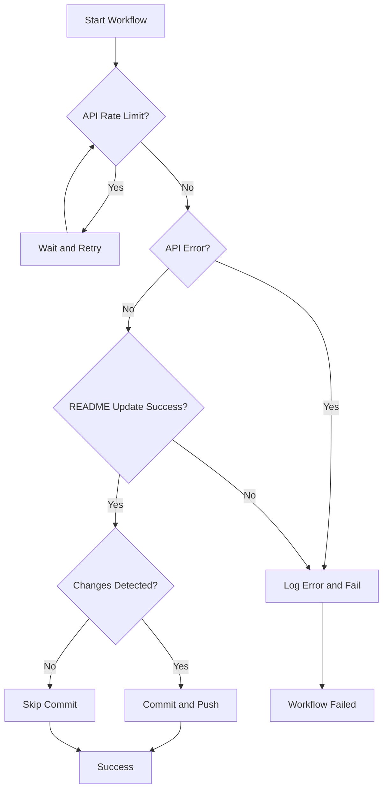

# Technical Design Document

## Overview

この機能は、GitHub ユーザーの全リポジトリからコードメトリクスを自動収集し、使用言語ランキング、コミット推移、コミット時間帯、サマリーカードなどの多様な SVG グラフを生成して README.md を自動更新する GitHub Actions ワークフローを提供します。

**Purpose**: GitHub プロフィールリポジトリの所有者に、自身の技術スタック、開発活動の推移、作業時間帯、総合統計などの包括的な情報を視覚的に表現する自動更新メカニズムを提供します。

**Users**: GitHub ユーザー（主にプロフィールリポジトリの所有者）がこのワークフローをリポジトリに設定し、定期的に実行されることで、最新の技術スタック情報を README.md に反映します。

**Impact**: 現在手動でメンテナンスしていたプロフィール情報を自動化し、常に最新のリポジトリ情報を反映したプロフィールを維持できます。

### Goals

- GitHub API を使用して対象ユーザーの全リポジトリ情報を効率的に収集する
- 収集したメトリクスから複数の分析結果を生成し、視覚的にわかりやすい SVG グラフを作成する（言語ランキング、コミット推移、コミット時間帯、サマリーカードなど）
- 生成した複数のグラフを README.md に自動的に埋め込み、変更をコミット・プッシュする
- スケジュール実行と手動実行の両方をサポートする GitHub Actions ワークフローを提供する
- API レート制限やエラー処理を適切に実装し、堅牢性を確保する

### Non-Goals

- リポジトリのクローンや完全なコードベース解析は行わない（GitHub API の情報を利用）
- 高度な統計分析や機械学習による予測は含まない（基本的な集計と可視化に限定）
- インタラクティブなグラフや動的なダッシュボードは提供しない（静的 SVG のみ）
- 他ユーザーのリポジトリ分析機能は提供しない（対象ユーザーのみ）

## Architecture

### High-Level Architecture



### Architecture Integration

- **Existing patterns preserved**: 新しいプロジェクトのため、既存パターンはなし
- **New components rationale**:
  - Repository Fetcher: GitHub API を使用してリポジトリ情報を効率的に取得
  - Metrics Aggregator: 言語データを集計し、ランキングを生成
  - SVG Generator: 集計データから視覚的な SVG グラフを生成
  - README Updater: 生成された SVG を README.md に埋め込み、Git 操作を実行
- **Technology alignment**: GitHub Actions の標準的なワークフローパターンに従う
- **Steering compliance**: シンプルで保守しやすい設計を維持

### Technology Stack and Design Decisions

#### Runtime Environment

- **Selection**: GitHub Actions の Ubuntu ランナー
- **Rationale**: GitHub Actions の標準環境で、Go などのツールが利用可能
- **Alternatives**:
  - ローカル実行環境: 自動化の利点が失われる
  - 他の CI/CD プラットフォーム: GitHub Actions が最もシームレス

#### Scripting Language

- **Selection**: Go 1.21+
- **Rationale**:
  - GitHub API との統合が容易（標準ライブラリ `net/http` または `github.com/google/go-github` パッケージ）
  - コンパイル済みバイナリで実行が高速
  - 静的型付けで型安全性が高い
  - 並列処理（goroutines）が容易で、API リクエストの並列化に適している
  - 単一のバイナリでデプロイが簡単
- **Alternatives**:
  - Python: 動的型付けで型安全性が低く、実行環境の依存関係が必要
  - Node.js: JavaScript/TypeScript でも可能だが、Go の方がパフォーマンスと型安全性に優れる
  - Shell script: 複雑な処理には不向き

#### SVG Generation Library

- **Selection**: Go で直接 SVG を生成（テンプレートベースまたは文字列フォーマット）
- **Rationale**:
  - 軽量で依存関係が少ない（標準ライブラリ `html/template` または `fmt` パッケージで十分）
  - カスタマイズが容易
  - コンパイル済みバイナリで実行時間が短い
- **Alternatives**:
  - 外部 SVG ライブラリ: この用途には過剰で依存関係が増える
  - JavaScript/Canvas to SVG: 実行環境が複雑になる
  - 画像生成ライブラリ（go-chart など）: SVG 専用には不要

#### GitHub API Client

- **Selection**: Go 標準ライブラリ `net/http` と `github.com/google/go-github/v56` パッケージ
- **Rationale**:
  - `net/http` は標準ライブラリで追加依存不要
  - `go-github` は公式推奨パッケージで型安全性が高い
  - REST エンドポイントとの統合が容易
  - レート制限ヘッダーの処理が容易
- **Alternatives**:
  - 標準ライブラリのみ: 実装可能だが、go-github の方が型安全で保守しやすい
  - GitHub CLI: コマンドライン実行が必要でワークフローに不向き

### Key Design Decisions

#### Decision 1: GitHub API の言語情報を使用（リポジトリクローンをしない）

**Context**: リポジトリのメトリクスを取得する方法として、完全クローンか API の言語情報かの選択が必要

**Alternatives**:

- 各リポジトリをクローンしてコード解析: より詳細な情報が得られるが、時間とリソースがかかる
- GitHub API の `/repos/{owner}/{repo}/languages` エンドポイント: 軽量で高速だが、言語情報のみ

**Selected Approach**: GitHub API の `/repos/{owner}/{repo}/languages` エンドポイントを使用

**Rationale**:

- 実行時間の短縮（ワークフロー実行時間の制限を考慮）
- リポジトリ数が多い場合でも現実的な実行時間
- 言語ランキング表示には十分な情報

**Trade-offs**:

- 利点: 高速、軽量、GitHub の標準データを使用
- 欠点: コード行数の詳細な内訳は取得できない（バイト数のみ）

#### Decision 2: README.md のコメントタグベースの更新方式

**Context**: README.md のどの部分を更新するかを識別する方法が必要

**Alternatives**:

- ファイル全体を置き換え: 既存のコンテンツが失われるリスク
- 特定セクションのパターンマッチング: 柔軟性が低い
- コメントタグ（`<!-- START_LANGUAGE_STATS -->` / `<!-- END_LANGUAGE_STATS -->`）: 明確で安全

**Selected Approach**: コメントタグを使用して更新セクションを識別

**Rationale**:

- 既存の README.md コンテンツを保持
- 更新セクションが明確
- 他の自動更新ツールと同様のパターン

**Trade-offs**:

- 利点: 安全、明確、既存コンテンツを保護
- 欠点: ユーザーがタグを手動で配置する必要がある（初回のみ）

#### Decision 3: 単一の Go プログラムで全処理を実装

**Context**: 複数のコンポーネントをどのように構成するか

**Alternatives**:

- 複数のパッケージに分割（fetcher, aggregator, generator, updater）: モジュール性が高いが、構造が複雑
- 単一パッケージ内で関数分離: シンプルで保守しやすい

**Selected Approach**: 単一の Go パッケージ内で関数として各処理を実装

**Rationale**:

- GitHub Actions ワークフローがシンプル（単一バイナリの実行）
- ファイル数が少なく、リポジトリ構造が簡潔
- 必要な機能は全て実現可能
- コンパイル済みバイナリで実行が高速

**Trade-offs**:

- 利点: シンプル、理解しやすい、保守しやすい、実行が高速
- 欠点: 将来的に拡張する場合、パッケージ分割などのリファクタリングが必要になる可能性

## System Flows

### Main Workflow Flow



### Error Handling Flow



## Requirements Traceability

| Requirement | Requirement Summary                  | Components                 | Interfaces                                                                        | Flows               |
| ----------- | ------------------------------------ | -------------------------- | --------------------------------------------------------------------------------- | ------------------- |
| 1.1         | GitHub API でリポジトリ一覧取得      | Repository Fetcher         | `fetchUserRepositories()`                                                         | Main Workflow Flow  |
| 1.2         | 各リポジトリの言語情報収集           | Repository Fetcher         | `fetchRepositoryLanguages()`                                                      | Main Workflow Flow  |
| 1.3-1.6     | 各リポジトリのメトリクス収集         | Repository Fetcher         | `fetchRepositoryMetrics()`, `fetchCommits()`, `fetchPullRequests()`               | Main Workflow Flow  |
| 1.7-1.9     | コミット履歴・時間帯・言語データ収集 | Repository Fetcher         | `fetchCommitHistory()`, `fetchCommitTimeDistribution()`, `fetchCommitLanguages()` | Main Workflow Flow  |
| 1.10        | フォークの除外                       | Metrics Aggregator         | `filterForkedRepositories()`                                                      | Main Workflow Flow  |
| 1.11        | API レート制限対応                   | Repository Fetcher         | `handleRateLimit()`                                                               | Error Handling Flow |
| 2.1-2.3     | 言語データの集計とランキング化       | Metrics Aggregator         | `aggregateLanguages()`, `rankLanguages()`                                         | Main Workflow Flow  |
| 2.4         | 閾値以下の言語除外                   | Metrics Aggregator         | `filterMinorLanguages()`                                                          | Main Workflow Flow  |
| 2.5         | コミット推移の集計                   | Metrics Aggregator         | `aggregateCommitHistory()`                                                        | Main Workflow Flow  |
| 2.6         | コミット時間帯の集計                 | Metrics Aggregator         | `aggregateCommitTimeDistribution()`                                               | Main Workflow Flow  |
| 2.7         | コミットごとの言語 Top5 集計         | Metrics Aggregator         | `aggregateCommitLanguages()`                                                      | Main Workflow Flow  |
| 2.8         | サマリー統計の集計                   | Metrics Aggregator         | `aggregateSummaryStats()`                                                         | Main Workflow Flow  |
| 2.9         | メトリクスデータの保存               | Metrics Aggregator         | `saveMetrics()`                                                                   | Main Workflow Flow  |
| 3.1         | 言語ランキング SVG 生成              | SVG Generator              | `generateLanguageChart()`                                                         | Main Workflow Flow  |
| 3.2         | コミット推移 SVG 生成                | SVG Generator              | `generateCommitHistoryChart()`                                                    | Main Workflow Flow  |
| 3.3         | コミットごとの言語 Top5 SVG 生成     | SVG Generator              | `generateCommitLanguagesChart()`                                                  | Main Workflow Flow  |
| 3.4         | コミット時間帯 SVG 生成              | SVG Generator              | `generateCommitTimeChart()`                                                       | Main Workflow Flow  |
| 3.5         | サマリーカード SVG 生成              | SVG Generator              | `generateSummaryCard()`                                                           | Main Workflow Flow  |
| 3.6-3.8     | SVG デザインと保存                   | SVG Generator              | SVG 生成全般, `saveSVG()`                                                         | Main Workflow Flow  |
| 4.1-4.3     | README.md 更新と SVG 埋め込み        | README Updater             | `updateReadme()`                                                                  | Main Workflow Flow  |
| 4.4         | 更新日時の記録                       | README Updater             | `updateReadme()`                                                                  | Main Workflow Flow  |
| 4.5-4.6     | コミットとプッシュ                   | README Updater             | `commitAndPush()`                                                                 | Main Workflow Flow  |
| 5.1         | スケジュール実行                     | GitHub Actions Workflow    | `schedule` trigger                                                                | Main Workflow Flow  |
| 5.2         | 手動実行                             | GitHub Actions Workflow    | `workflow_dispatch` trigger                                                       | Main Workflow Flow  |
| 5.3         | GitHub トークン権限                  | GitHub Actions Workflow    | `permissions` configuration                                                       | Main Workflow Flow  |
| 5.4         | デフォルトユーザー設定               | Go Program                 | `getTargetUser()`                                                                 | Main Workflow Flow  |
| 5.5-5.6     | ログ記録とエラー処理                 | Go Program, GitHub Actions | Error handling throughout                                                         | Error Handling Flow |

## Components and Interfaces

### Repository Fetcher

**Responsibility & Boundaries**

- **Primary Responsibility**: GitHub API を使用して対象ユーザーのリポジトリ情報と言語データを取得する
- **Domain Boundary**: データ収集ドメイン
- **Data Ownership**: 一時的な API レスポンスデータを保持し、メトリクス集計モジュールに渡す
- **Transaction Boundary**: API リクエストのトランザクション単位

**Dependencies**

- **Inbound**: メインワークフローから呼び出される
- **Outbound**: GitHub REST API (`/users/{username}/repos`, `/repos/{owner}/{repo}/languages`)
- **External**: `net/http` 標準ライブラリ、`github.com/google/go-github/v56` パッケージ、`GITHUB_TOKEN` 環境変数

**Contract Definition**

**Service Interface**:

```go
// fetchUserRepositories GitHub API を使用してユーザーのリポジトリ一覧を取得する
//
// Preconditions:
// - username が非空文字列であること
// - token が有効な GitHub トークンであること
//
// Postconditions:
// - フォークを除外する場合は、Fork=false のリポジトリのみが返される
// - スライスはリポジトリ構造体のスライスである
//
// Invariants:
// - API レート制限に達した場合は待機して再試行する
func fetchUserRepositories(ctx context.Context, client *github.Client, username string, excludeForks bool) ([]*github.Repository, error)

// fetchRepositoryLanguages 指定されたリポジトリの言語統計を取得する
//
// Preconditions:
// - owner と repo が有効なリポジトリ識別子であること
// - client が有効な GitHub クライアントであること
//
// Postconditions:
// - 返される map は map[string]int{言語名: バイト数} の形式である
//
// Invariants:
// - API エラー時は適切なエラーを返す
func fetchRepositoryLanguages(ctx context.Context, client *github.Client, owner, repo string) (map[string]int, error)

// fetchCommits 指定されたリポジトリのコミット履歴を取得する
//
// Preconditions:
// - owner と repo が有効なリポジトリ識別子であること
// - client が有効な GitHub クライアントであること
//
// Postconditions:
// - 返されるスライスはコミット情報のリストである
//
// Invariants:
// - ページネーションを使用して全コミットを取得する
func fetchCommits(ctx context.Context, client *github.Client, owner, repo string) ([]*github.RepositoryCommit, error)

// fetchCommitHistory 日付ごとのコミット数を取得する
//
// Preconditions:
// - commits が有効なコミットリストであること
//
// Postconditions:
// - 返される map は map[string]int{日付: コミット数} の形式である
//
// Invariants:
// - 日付は YYYY-MM-DD 形式で記録される
func fetchCommitHistory(ctx context.Context, client *github.Client, owner, repo string) (map[string]int, error)

// fetchCommitTimeDistribution 時間帯ごとのコミット数を取得する
//
// Preconditions:
// - commits が有効なコミットリストであること
//
// Postconditions:
// - 返される map は map[int]int{時間帯(0-23): コミット数} の形式である
//
// Invariants:
// - 時間帯は UTC またはローカル時間で集計される
func fetchCommitTimeDistribution(ctx context.Context, client *github.Client, owner, repo string) (map[int]int, error)

// fetchCommitLanguages コミットごとの使用言語を取得する
//
// Preconditions:
// - commits が有効なコミットリストであること
//
// Postconditions:
// - 返される map は map[string][]string{コミットSHA: 言語リスト} の形式である
//
// Invariants:
// - 各コミットの変更ファイルから言語を抽出する
func fetchCommitLanguages(ctx context.Context, client *github.Client, owner, repo string) (map[string][]string, error)

// fetchPullRequests 指定されたリポジトリのプルリクエスト数を取得する
//
// Preconditions:
// - owner と repo が有効なリポジトリ識別子であること
// - client が有効な GitHub クライアントであること
//
// Postconditions:
// - 返される値はプルリクエストの総数である
//
// Invariants:
// - ページネーションを使用して全PRを取得する
func fetchPullRequests(ctx context.Context, client *github.Client, owner, repo string) (int, error)

// handleRateLimit API レート制限を検出し、適切に待機する
//
// Preconditions:
// - resp が GitHub API レスポンスであること
//
// Postconditions:
// - レート制限に達している場合は、制限解除まで待機する
//
// Invariants:
// - 待機時間はレスポンスヘッダーから計算される
func handleRateLimit(ctx context.Context, resp *github.Response) error
```

### Metrics Aggregator

**Responsibility & Boundaries**

- **Primary Responsibility**: 収集したリポジトリと言語データを集計し、ランキングを生成する
- **Domain Boundary**: データ分析ドメイン
- **Data Ownership**: 集計結果データを生成し、SVG 生成モジュールに渡す
- **Transaction Boundary**: 集計処理のトランザクション単位

**Dependencies**

- **Inbound**: Repository Fetcher からリポジトリデータを受け取る
- **Outbound**: SVG Generator に集計データを渡す
- **External**: なし（純粋なデータ処理）

**Contract Definition**

**Service Interface**:

```go
// aggregateLanguages 全リポジトリの言語データを集計する
//
// Preconditions:
// - repositories がリポジトリ構造体のスライスであること
// - languageData が map[string]map[string]int{リポジトリ名: {言語: バイト数}} の形式であること
//
// Postconditions:
// - 返される map は map[string]int{言語名: 総バイト数} の形式である
// - フォークされたリポジトリのデータは除外されている
//
// Invariants:
// - 同じ言語のデータは合算される
func aggregateLanguages(repositories []*github.Repository, languageData map[string]map[string]int) map[string]int

// rankLanguages 言語データをランキング化する
//
// Preconditions:
// - languageTotals が map[string]int{言語名: 総バイト数} の形式であること
//
// Postconditions:
// - 返されるスライスは LanguageStat 構造体のスライスで、バイト数降順にソートされている
//
// Invariants:
// - パーセンテージの合計は 100% になる（丸め誤差を除く）
func rankLanguages(languageTotals map[string]int) []LanguageStat

// filterMinorLanguages 閾値以下の言語を除外する
//
// Preconditions:
// - rankedLanguages がランキング済み言語スライスであること
// - threshold が 0 以上 100 以下であること
//
// Postconditions:
// - 返されるスライスは閾値以上のパーセンテージを持つ言語のみを含む
//
// Invariants:
// - 元のスライスの順序が保持される
func filterMinorLanguages(rankedLanguages []LanguageStat, threshold float64) []LanguageStat

// aggregateCommitHistory 日付ごとのコミット数を集計する
//
// Preconditions:
// - commitHistories が map[string]map[string]int{リポジトリ名: {日付: コミット数}} の形式であること
//
// Postconditions:
// - 返される map は map[string]int{日付: 合計コミット数} の形式である
//
// Invariants:
// - 全リポジトリの日付ごとのコミット数が合算される
func aggregateCommitHistory(commitHistories map[string]map[string]int) map[string]int

// aggregateCommitTimeDistribution 時間帯ごとのコミット数を集計する
//
// Preconditions:
// - timeDistributions が map[string]map[int]int{リポジトリ名: {時間帯: コミット数}} の形式であること
//
// Postconditions:
// - 返される map は map[int]int{時間帯: 合計コミット数} の形式である
//
// Invariants:
// - 全リポジトリの時間帯ごとのコミット数が合算される
func aggregateCommitTimeDistribution(timeDistributions map[string]map[int]int) map[int]int

// aggregateCommitLanguages コミットごとの使用言語Top5を集計する
//
// Preconditions:
// - commitLanguages が map[string]map[string][]string{リポジトリ名: {コミットSHA: 言語リスト}} の形式であること
//
// Postconditions:
// - 返される map は map[string]int{言語名: 使用回数} の形式で、Top5のみを含む
//
// Invariants:
// - 使用回数が多い順にソートされ、上位5つが返される
func aggregateCommitLanguages(commitLanguages map[string]map[string][]string) map[string]int

// aggregateSummaryStats サマリー統計を集計する
//
// Preconditions:
// - repositories がリポジトリ構造体のスライスであること
// - 各リポジトリにスター数、コミット数、PR数が含まれること
//
// Postconditions:
// - 返される構造体には合計スター数、リポジトリ数、総コミット数、総PR数が含まれる
//
// Invariants:
// - 全リポジトリの値を合算する
func aggregateSummaryStats(repositories []*github.Repository, totalCommits, totalPRs int) SummaryStats
```

### SVG Generator

**Responsibility & Boundaries**

- **Primary Responsibility**: ランキングデータから視覚的な SVG グラフを生成する
- **Domain Boundary**: 可視化ドメイン
- **Data Ownership**: SVG 文字列を生成し、ファイルとして保存する
- **Transaction Boundary**: SVG 生成処理のトランザクション単位

**Dependencies**

- **Inbound**: Metrics Aggregator からランキングデータを受け取る
- **Outbound**: ファイルシステムに SVG ファイルを保存する
- **External**: なし（直接 SVG を生成）

**Contract Definition**

**Service Interface**:

```go
// generateLanguageChart 言語ランキングデータから SVG グラフを生成する
//
// Preconditions:
// - rankedLanguages がランキング済み言語スライスであること
// - maxItems が正の整数であること
//
// Postconditions:
// - 返される文字列は有効な SVG 形式である
// - SVG には言語名、使用量、パーセンテージが含まれる
// - 上位 maxItems 件の言語のみが表示される
//
// Invariants:
// - SVG は適切なサイズとスタイリングを持つ
// - テキストは読みやすく表示される
func generateLanguageChart(rankedLanguages []LanguageStat, maxItems int) (string, error)

// generateCommitHistoryChart コミット合計の推移を表示する SVG グラフを生成する
//
// Preconditions:
// - commitHistory が map[string]int{日付: コミット数} の形式であること
//
// Postconditions:
// - 返される文字列は有効な SVG 形式である
// - SVG には日付ごとのコミット数の推移が表示される
//
// Invariants:
// - SVG は適切なサイズとスタイリングを持つ
func generateCommitHistoryChart(commitHistory map[string]int) (string, error)

// generateCommitLanguagesChart コミットごとの使用言語Top5を表示する SVG を生成する
//
// Preconditions:
// - commitLanguages が map[string]int{言語名: 使用回数} の形式であること
//
// Postconditions:
// - 返される文字列は有効な SVG 形式である
// - SVG にはTop5の言語とその使用回数が表示される
//
// Invariants:
// - 上位5つの言語のみが表示される
func generateCommitLanguagesChart(commitLanguages map[string]int) (string, error)

// generateCommitTimeChart コミットが多い時間帯を表示する SVG グラフを生成する
//
// Preconditions:
// - timeDistribution が map[int]int{時間帯: コミット数} の形式であること
//
// Postconditions:
// - 返される文字列は有効な SVG 形式である
// - SVG には時間帯ごとのコミット数が表示される
//
// Invariants:
// - 24時間すべての時間帯が表示される
func generateCommitTimeChart(timeDistribution map[int]int) (string, error)

// generateSummaryCard スター数、リポジトリ数、コミット数、PR数を表示するサマリーカードの SVG を生成する
//
// Preconditions:
// - stats が SummaryStats 構造体であること
//
// Postconditions:
// - 返される文字列は有効な SVG 形式である
// - SVG には各メトリクスの値とアイコンが表示される
//
// Invariants:
// - カード形式で見やすく表示される
func generateSummaryCard(stats SummaryStats) (string, error)

// saveSVG SVG コンテンツをファイルに保存する
//
// Preconditions:
// - svgContent が有効な SVG 文字列であること
// - filepath が有効なファイルパスであること
//
// Postconditions:
// - 指定されたパスに SVG ファイルが作成される
//
// Invariants:
// - ファイルのエンコーディングは UTF-8 である
func saveSVG(svgContent, filepath string) error
```

### README Updater

**Responsibility & Boundaries**

- **Primary Responsibility**: README.md の特定セクションを更新し、Git 操作を実行する
- **Domain Boundary**: ファイル操作と Git 操作ドメイン
- **Data Ownership**: README.md ファイルの内容を管理する
- **Transaction Boundary**: ファイル更新と Git 操作のトランザクション単位

**Dependencies**

- **Inbound**: SVG Generator から SVG ファイルパスを受け取る
- **Outbound**: ファイルシステム（README.md の読み書き）、Git コマンド（コミット・プッシュ）
- **External**: Go 標準ライブラリ `os/exec` パッケージ（Git コマンド実行）

**Contract Definition**

**Service Interface**:

```go
// updateReadme README.md の指定セクションを SVG グラフで更新する
//
// Preconditions:
// - readmePath が有効な README.md ファイルパスであること
// - svgPath が有効な SVG ファイルパスであること
// - startTag と endTag が README.md 内に存在すること
//
// Postconditions:
// - README.md の startTag と endTag の間が SVG コンテンツで置き換えられる
// - 更新日時が記録される
// - ファイルが保存される
//
// Invariants:
// - 既存の README.md コンテンツ（タグ外）は保持される
func updateReadme(readmePath, svgPath, startTag, endTag string) error

// commitAndPush 変更をコミットし、リポジトリにプッシュする
//
// Preconditions:
// - Git リポジトリが初期化されていること
// - 変更があること（README.md または SVG ファイル）
// - 適切な Git 認証情報が設定されていること
//
// Postconditions:
// - 変更がコミットされる
// - 変更がリモートリポジトリにプッシュされる
//
// Invariants:
// - コミットメッセージが適切に設定される
// - プッシュが成功するまでエラーが発生する可能性がある
func commitAndPush(ctx context.Context, message string) error
```

## Data Models

### Repository Data Model

**Logical Data Model**:

```go
// Repository GitHub リポジトリの基本情報
// github.Repository 型を使用（go-github パッケージから）
type Repository = github.Repository
```

### Language Statistics Model

**Logical Data Model**:

```go
// LanguageStat 言語統計情報
type LanguageStat struct {
    Language      string  // 言語名
    Bytes         int     // 総バイト数
    Percentage    float64 // 全体に占める割合（パーセンテージ）
    RepositoryCount int   // 使用されているリポジトリ数（将来的な拡張用）
}
```

### Aggregated Metrics Model

**Logical Data Model**:

```go
// AggregatedMetrics 集計されたメトリクス
type AggregatedMetrics struct {
    Languages            []LanguageStat        // ランキング済み言語スライス
    TotalBytes           int                  // 全言語の総バイト数
    RepositoryCount      int                  // 対象リポジトリ数
    CommitHistory        map[string]int        // 日付ごとのコミット数
    CommitTimeDistribution map[int]int         // 時間帯ごとのコミット数
    CommitLanguages      map[string]int        // コミットごとの使用言語Top5
    SummaryStats         SummaryStats         // サマリー統計
    LastUpdated          time.Time            // 最終更新日時
}

// SummaryStats サマリー統計情報
type SummaryStats struct {
    TotalStars           int    // 合計スター数
    RepositoryCount      int    // リポジトリ数
    TotalCommits         int    // 総コミット数
    TotalPullRequests    int    // 総プルリクエスト数
}
```

## Error Handling

### Error Strategy

エラーは発生箇所に応じて適切に処理し、ワークフローの失敗を明確に報告します。致命的でないエラー（個別リポジトリの取得失敗など）はログに記録してスキップし、ワークフローを継続します。

### Error Categories and Responses

**User Errors (4xx)**:

- **Invalid username**: 無効な GitHub ユーザー名 → エラーメッセージを出力し、ワークフローを失敗として終了
- **Unauthorized (401)**: 無効または期限切れのトークン → エラーメッセージを出力し、ワークフローを失敗として終了
- **Not Found (404)**: ユーザーまたはリポジトリが見つからない → エラーメッセージを出力し、ワークフローを失敗として終了

**System Errors (5xx)**:

- **GitHub API Server Error**: GitHub API の一時的な障害 → 指数バックオフでリトライ（最大 3 回）、失敗時はワークフローを失敗として終了
- **Rate Limit (403)**: API レート制限に達した → レスポンスヘッダーから待機時間を計算し、適切に待機して再試行
- **Network Timeout**: ネットワークタイムアウト → リトライ（最大 3 回）、失敗時はワークフローを失敗として終了

**Business Logic Errors**:

- **README.md tags not found**: コメントタグが見つからない → 警告を出力し、README.md を更新せずにワークフローを成功として終了（初回セットアップガイダンスを提供）
- **No changes detected**: 変更が検出されない → 情報ログを出力し、コミットをスキップしてワークフローを成功として終了
- **Git push failure**: プッシュが失敗（権限エラーなど） → エラーメッセージを出力し、ワークフローを失敗として終了

### Monitoring

- **Logging**: Go 標準ライブラリ `log` パッケージまたは構造化ログライブラリ（`log/slog` など）を使用し、INFO レベルで主要な処理ステップを記録
- **Error Tracking**: エラー発生時は ERROR レベルでログを記録し、スタックトレースを含める（`errors` パッケージの error wrapping を使用）
- **GitHub Actions Logs**: すべてのログは GitHub Actions の実行ログに表示される
- **Health Check**: ワークフロー実行の成功/失敗が GitHub Actions のステータスで確認可能

## Testing Strategy

### Unit Tests

1. **Repository Fetcher モジュール**:

   - `fetch_user_repositories()`: 正常系（リポジトリリスト取得）、異常系（無効なユーザー名、API エラー）
   - `fetch_repository_languages()`: 正常系（言語データ取得）、異常系（存在しないリポジトリ）
   - `handle_rate_limit()`: レート制限ヘッダーの解析と待機時間計算

2. **Metrics Aggregator モジュール**:

   - `aggregate_languages()`: 複数リポジトリの言語データ集計、フォーク除外
   - `rank_languages()`: ランキング順序の検証、パーセンテージ計算の精度
   - `filter_minor_languages()`: 閾値によるフィルタリングの正確性

3. **SVG Generator モジュール**:

   - `generate_language_chart()`: SVG 形式の妥当性、最大表示件数の制限
   - `save_svg()`: ファイル保存の成功、エンコーディングの検証

4. **README Updater モジュール**:
   - `update_readme()`: コメントタグ間のコンテンツ置換、既存コンテンツの保持
   - `commit_and_push()`: Git コマンド実行のモックと検証

### Integration Tests

1. **End-to-End Workflow**:

   - GitHub API モックを使用した完全なワークフロー実行
   - README.md 更新から Git 操作までの一連の流れ

2. **GitHub API Integration**:

   - 実際の GitHub API を使用したテスト（テスト用リポジトリ）
   - レート制限処理の動作確認

3. **File Operations**:
   - README.md の読み書き操作、SVG ファイルの生成と保存

### GitHub Actions Workflow Tests

1. **Workflow Execution**:

   - スケジュール実行のテスト（手動トリガーで模擬）
   - `workflow_dispatch` トリガーのテスト

2. **Permissions and Security**:
   - `GITHUB_TOKEN` の権限設定の検証
   - シークレットの参照テスト

## Security Considerations

### Authentication and Authorization

- **GITHUB_TOKEN**: GitHub Actions の組み込み `GITHUB_TOKEN` を使用し、必要最小限の権限（`contents: write`）を設定
- **Token Scope**: リポジトリのコンテンツ読み書きのみに限定し、他のリポジトリへのアクセスは不可

### Data Protection

- **User Data**: GitHub API から取得したデータは一時的にのみ保持し、ワークフロー実行後にクリア
- **Repository Information**: プライベートリポジトリの情報は取得しない（対象ユーザーが所有するパブリックリポジトリのみ）

### Input Validation

- **Username Validation**: ユーザー名の形式を検証（GitHub のユーザー名規則に準拠）
- **File Path Validation**: ファイルパスの安全性を検証し、ディレクトリトラバーサル攻撃を防止

### Error Information Disclosure

- **Sensitive Data**: エラーメッセージにトークンや機密情報を含めない
- **Logging**: ログに機密情報を出力しない

## Performance & Scalability

### Target Metrics

- **Workflow Execution Time**: リポジトリ数 100 個以下で 5 分以内
- **API Request Efficiency**: ページネーションを使用して API リクエスト数を最小化
- **Memory Usage**: リポジトリ数が多くてもメモリ使用量を抑制（ストリーミング処理を検討）

### Optimization Strategies

- **API Rate Limiting**: レート制限を監視し、適切な待機時間を設定
- **Parallel Processing**: 複数リポジトリの言語データ取得を並列化（API レート制限を考慮）
- **Caching**: 同じワークフロー実行内で同じリポジトリのデータを再利用

### Scalability Considerations

- **Large Repository Counts**: リポジトリ数が 100 を超える場合、サンプリングや制限を考慮
- **API Rate Limits**: GitHub API のレート制限（認証済み: 5000 リクエスト/時間）を考慮した設計
